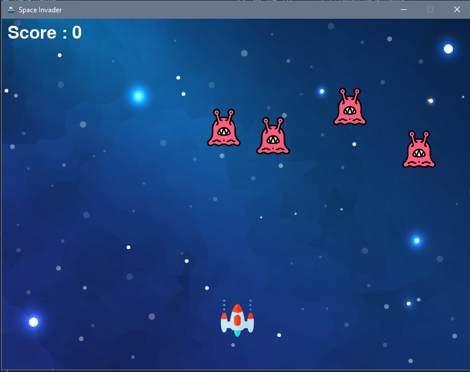

# Space Invader Game With PyGame

> This is basic space game using pygame and made by following freecodecamp tutorial

[](https://www.python.org)
[](https://pypi.org/project/pygame/)


## Installation

You can install or clone the repo from github repository.

## Usage Example

You can run the game via cmd in Windows:

```py main.py```

When you run the file, you will see the game screen.



The aim of the game is to raise the scoreboard by shooting aliens.You can move the spaceship with the `arrow keys` and shoot with the `space` key.

If even any of the aliens reach the level that cannot be hit, the game is over.You can change number of the aliens, if you want.


Have a nice try!

If you run into a problem, you can let me know here or on my Twitter account. - [@Mehmetkaragoz07](https://twitter.com/Mehmetkaragoz07) - karagoz.mhmtg@gmail.com

https://github.com/mehmet-karagoz
